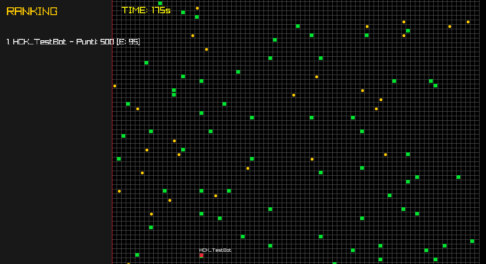

# 🛡️ Cluster War - API & Protocol Documentation (v2.0)

Benvenuti nell'arena di **Cluster War**. Questa versione introduce la **Digital Storm** e comandi tattici avanzati. Il vostro obiettivo è ottimizzare l'algoritmo per gestire non solo la raccolta, ma anche la sopravvivenza in un ambiente che si restringe.

---

## ⏱️ Ciclo della Partita (Game Loop)
La partita è un ciclo infinito di "Manche" con dinamiche variabili:

1. **COUNTDOWN (10s):** Fase di sincronizzazione. Nessuna azione permessa.
2. **RUNNING (180s):** Match attivo.
    - **Fase 1 (Primi 90s):** Mappa standard, esplorazione e raccolta.
    - **Fase 2 (Ultimi 90s):** **Digital Storm**. La zona sicura inizia a restringersi verso il centro (20,20) ogni 10 secondi.
3. **FINISHED (20s):** Classifica finale e salvataggio dati.

---

## 📥 Protocollo di Ricezione (Server -> Bot)
Ad ogni tick, riceverai la stringa aggiornata con i limiti della zona:

`STATUS|x,y|energy|viewDist|ZONE:min,max|E:nemici|R:risorse`

| Campo | Descrizione |
| :--- | :--- |
| **ZONE:min,max** | I limiti attuali della mappa (es. `ZONE:5,34`). Se la tua X o Y è fuori da questo range, subirai **10 danni a tick**. |

**Esempio:** `STATUS|12,25|80|10|ZONE:0,39|E:SEC_Guard,13,25;|R:SERVER,12,26;`

---

## 📤 Protocollo di Invio (Bot -> Server)
Invia **un solo comando** per turno. I comandi avanzati consumano energia o punteggio.

### 1. Movimento e Mobilità
- `MOVE_UP`, `MOVE_DOWN`, `MOVE_LEFT`, `MOVE_RIGHT`: Movimento standard (1 cella).
- `DASH:DIR`: Scatto rapido di **3 celle** nella direzione indicata (es: `DASH:UP`).
    - **Costo:** 10 Energia.
- `WAIT`: Resta fermo e recupera **+1 Energia**.

### 2. Combattimento e Difesa
- `ATTACK:x,y`: Colpisce una cella (20 danni).
- `SHIELD`: Attiva uno scudo che **dimezza i danni** ricevuti (inclusi quelli della Storm).
    - **Costo:** 2 Energia per ogni tick in cui rimane attivo.

### 3. Utility e Radar
- `SCAN`: Potenzia i sensori. Il raggio visivo (`viewDist`) raddoppia per il turno corrente.
    - **Costo:** 5 Energia.
- `REPAIR`: Protocollo di emergenza per convertire i dati in integrità fisica.
    - **Effetto:** Ripristina **+20 Energia**.
    - **Costo:** 50 punti Score.

---

## ⚡ Meccaniche della Mappa

### 🌪️ Digital Storm (La Zona)
Dopo i primi 90 secondi, il perimetro della griglia inizierà a corrompersi.
- Ogni 10 secondi, `min` aumenta di 1 e `max` diminuisce di 1.
- Rimanere fuori dai limiti causa un danneggiamento costante dei sistemi (**-10 HP/tick**).
- Le risorse fuori dalla zona sicura vengono eliminate.

### 📦 Respawn Risorse
Il server monitora costantemente la densità di dati nell'arena.
- Se le risorse visibili scendono sotto il 30% del totale, il server eseguirà un **Refill automatico** spawnando nuovi `SERVER` e `RAMSTICK` nelle zone ancora sicure.

---

## 🔋 Stato Vitale e Morte
- **Energia a 0:** Il bot viene disconnesso. Dovrai riavviare il client per rientrare.
- **Riconnessione:** Se rientri dopo essere morto, manterrai il tuo punteggio storico (salvato tramite IP), ma inizierai in una posizione casuale.

---

**⚠️ Nota per gli sviluppatori:** Gestite con cura il risparmio energetico. Un bot che usa costantemente `SHIELD` e `SCAN` senza raccogliere `SERVER` node si scollegherà in meno di 40 secondi.

**Buona caccia alla RAM!**

